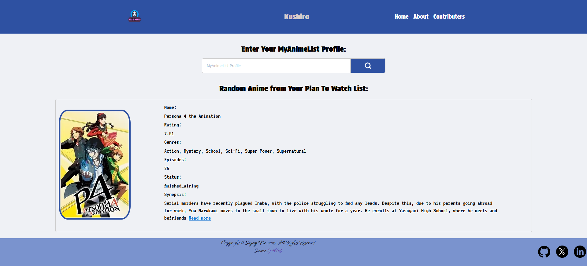
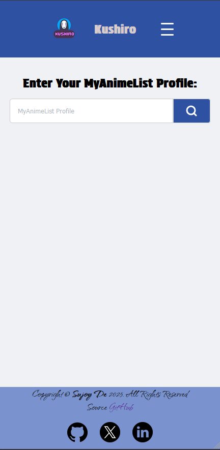

<h1 align="center">🌸 Kushiro - Your Random Anime Selector</h1>
  <p align="center">
    &nbsp;
    <a href="https://github.com/desujoy/kushiro/stargazers" target="_blank">
    </a>&nbsp;
    <a href="https://github.com/desujoy/kushiro/blob/master/LICENSE" target="_blank">
    </a>&nbsp;
    <a href="https://github.com/desujoy/kushiro/issues" target="_blank">
    </a>&nbsp;
    <a href="https://github.com/desujoy/kushiro/pulls" target="_blank">
      </a>
  </p>

## ✨ Overview
**Kushiro** is a simple yet delightful tool designed to fetch and display random anime from your "Plan to Watch" list on MyAnimeList (MAL). If you're unsure what to watch next, let Kushiro surprise you with a random pick!

---

## 🌟 Features
- 🎲 Fetches random anime from your "Plan to Watch" list.
- 💻 User-friendly web interface.
- 🚀 Quick setup and seamless integration with MyAnimeList.

---

## 🔧 Prerequisites
Before starting, ensure you have the following installed on your system:

- **Node.js**  
  Download and install it from the [Node.js Official Website](https://nodejs.org/en).

---

## 🛠 Installation
Follow these steps to set up Kushiro on your local machine:

### 1️⃣ Clone the Repository:
```bash
git clone https://github.com/desujoy/kushiro
cd kushiro
```

### 2️⃣ Set Up the Environment:
- Retrieve your **MyAnimeList Client ID** by creating an application on [MyAnimeList API Configuration](https://myanimelist.net/apiconfig).
- Copy the Client ID and paste it into the `sample.env` file.
- Rename `sample.env` to `.env`:
  ```bash
  mv sample.env .env
  ```

### 3️⃣ Install Dependencies:
```bash
npm install
```

### 4️⃣ Start the Application:
```bash
node index.js
```

### 5️⃣ Access the Application:
Open the application in your browser at:  
[http://localhost:3000/](http://localhost:3000/)

---

## 📸 Screenshots

### 🏠 Desktop


### 🎬 Mobile


---

## 🤝 Contributing
Please follow the [CONTRIBUTING GUIDE](CONTRIBUTING.md)

---

## 📜 License
This project is licensed under the [MIT License](LICENSE).

---

## 🛡 Support
If you encounter any issues or have questions, feel free to open an issue on the [GitHub repository](https://github.com/desujoy/kushiro/issues).

---

## 📖 Additional Notes
- Ensure your MyAnimeList account has the "Plan to Watch" list populated for the app to function properly.
- Feel free to customize the UI and add new features to enhance your experience.

---

## Project Contributers: 
<a href="https://github.com/desujoy/kushiro/graphs/contributors">


---

## 🎉 Happy Watching!
Let **Kushiro** guide your next anime journey! 🌟